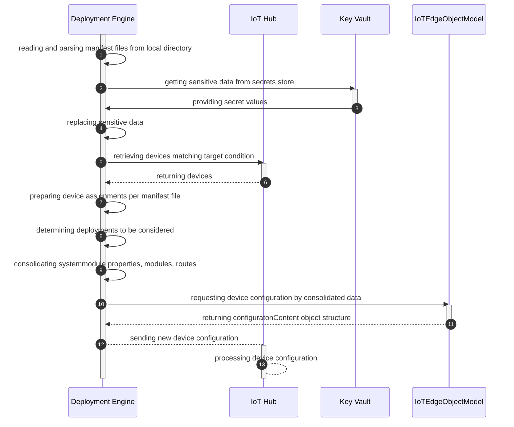
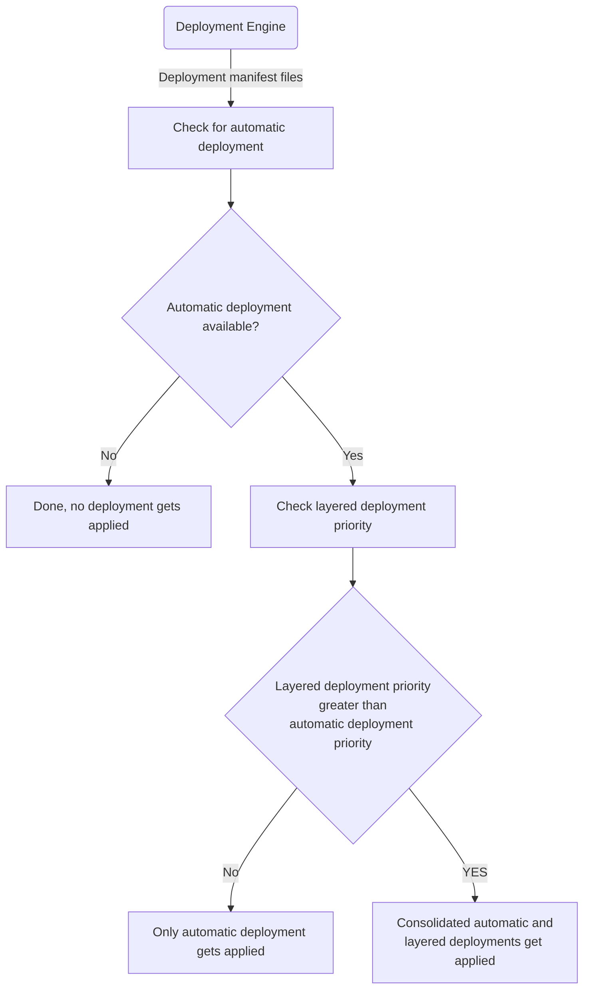
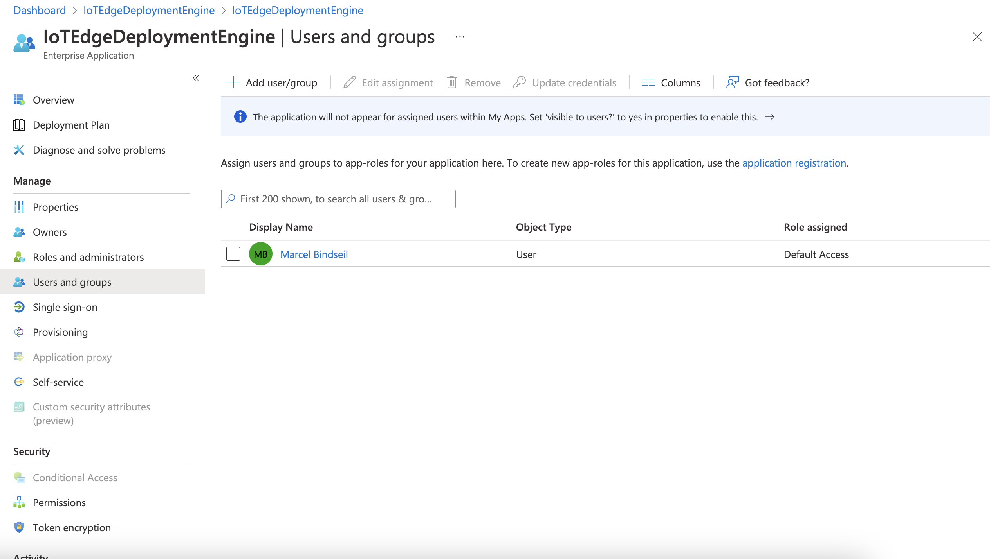
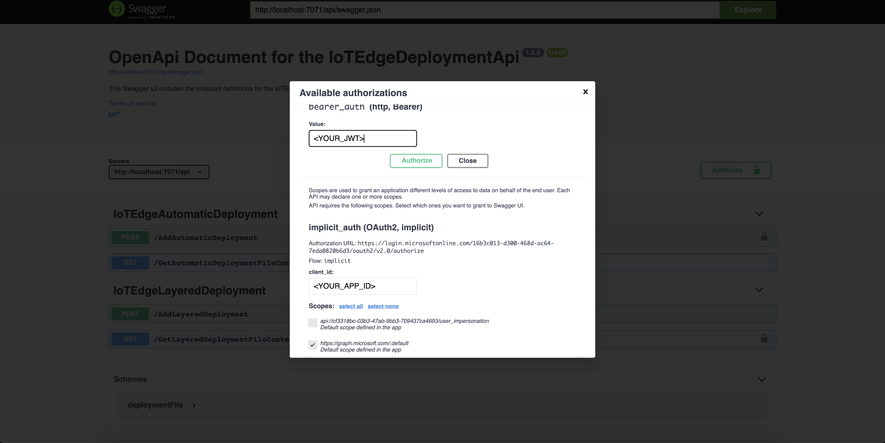

[](https://github.com/Bindsi/IoTEdgeDeploymentService/actions/workflows/CD_Infra.yml)

# Contents

- [Introduction](#introduction-at-scale-deployment)
- [Solution](#solution)
- [How-to: developer setup](#developer-testing)
- [Azure Pipelines CI/CD setup](#azure-pipelines-cicd-setup)
- [A few notes on performance](#a-few-notes-on-performance)

# Introduction: At-scale Deployment

Azure IoT Edge provides two approaches for [deployments](https://learn.microsoft.com/en-us/azure/iot-edge/module-deployment-monitoring?view=iotedge-1.4).
On the one hand you can create a per-device deployment manifest to deploy modules and apply it to one single device.
On the other hand you can create a deployment manifest with a tag based filter and modules get applied to the registered devices that matches the defined condition.
The latter one contains automatic deployments where the deployments of the higher priority are only applied to the devices with the same tag(s)
and layered deployment where modules and routes are consolidated between different deployment definitions for the same devices based by higher priority.

Industries make use of at-scale deployments to define new sets of modules for devices categorized by different keys, e.g. country, region, plant, build etc.
Due to cost savings and to avoid a blown-up cloud environment the same IoT Hub instances are used over several departments.
Hence, the customers have the requirement to define a huge amount of at-scale deployments, particularly if they want to be downwards compatible.
Currently, there is still a limit of 100 at-scale deployments you can specify for the IoT Hub instance in Azure Portal or via IoT Hub SDK.
So, this leads to the need to build an own deployment engine without limitation with a kind of more flexibility.

# Solution

## File-based IoTEdgeDeploymentEngine library

### Sequence Diagram for Deployment Processing



### Automatic and Layered Deployment Rules

IoT Hub applies automatic and layered deployments in a consolidated fashion based on predefined rules based on priority per devices met by the target condition.

A layered deployment requires an automatic deployment - including system modules like EdgeAgent and EdgeHub - as base deployment to get applied.
That means that every layered deployment with a lower priority than the automatic deployment with the highest priority is not applied to the subset of devices while only the automatic deployment with highest priority is deployed as well.

The following flow charts outlines those rules.



### Azure Key Vault for secret placeholder replacement

The automatic and layered `.json` files can make use of secret replacement via Azure Key Vault. This prevents secrets from being committed to the Git repo.

To replace secrets, usage of this form is supported `{{secret_name}}`.
- The secret name as defined between the double `{{` and `}}` needs to exist in the Key Vault.
- The replacement can happen anywhere within the file and is applied before the final merging happens in memory.

## Azure Function: IoTEdgeDeploymentApi

### Overview

Azure Function which provides API and scheduler functionalities to manage the engine.
Swagger UI is fully supported and can be opened via the following [URL][def].

### Security

Azure Functions API is secured by OAuth2 and applied via ARM deployment by using the deployment scripts.
Two app registrations are created, one that is referenced by the Azure Function for authentication and one that is used for the Implicit Flow in the Swagger UI provided by the Azure Function.

### LayeredDeployment

Provides the following endpoints:

- submit a new layered deployment manifest to be stored
- retrieve deployment manifest file content by a specified file path

### AutomaticDeployment

Provides the following endpoints:

- submit a new automatic deployment manifest to be stored
- retrieve deployment manifest file content by a specified file path
- apply all deployments on a per device single deployment basis

### DeploymentScheduler

Executes an automatic base and any additional layer into a single per device deployment on a timer-based way (default setup: 12:00am).

## Console App: IoTEdgeDeploymentTester

A simple console application that can test the engine on your developer environment.

# Developer testing

## Pre-requisites for local testing

- .NET 6
- Visual Studio Code or Visual Studio 2022
- Azure CLI
- PowerShell 7.0.6 LTS or PowerShell 7.1.3 or higher (on Windows only: Windows PowerShell 5.1 is sufficient) for running the Azure resource deployment scripts
- Azure subscription, and permissions to create resources and Azure AD app registrations

## What resources get created

The deployment script creates Azure resources for running the tool locally with a few cloud components:
- **Azure Resource Group** to hold the resources.
- **Azure IoT Hub** with two IoT Edge devices provisioned.
- **Azure Function** and Service Plan, although not required for local testing it prepares the system for tesing the Azure Function remotely.
  - The Azure Function is secured through the built-in Authentication feature.
- Two **Azure AD Applications and Service Principals**:
  - For setting up Authentication with Azure Function.
  - A secondary registration for acquiring an Access Token through Postman.
- **Azure Key Vault** with three secrets.
- **Azure Storage** account as required by the Azure Function.
- Azure role assignments: your current logged in user is assigned several contributor RBAC permissions for the Azure IoT Hub and the Azure Key Vault. This is required in order to run the solution locally.
- **Application Insights** account for Azure Functions monitoring.

## Developer step-by-step

### Deploy Azure resources

1. Open a PowerShell terminal, move into the folder `./deployment`.
2. Login into your Azure account and set your preferred subscription.

  ```powershell
  az login
  az account show #check if the default account is correct, otherwise run az account set -s 'yoursubscription'
  ```

3. Run the deployment script where the following arguments should be supplied:
  - `resourcesPrefix` - a short prefix of 6 to 8 characters, unique enough to ensure the resource names don't already exist. 
  - `tenantName` - your current tenant for configuring App registrations. This will be used to further concatenate to the full tenant URI like `mytentant.onmicrosoft.com`.

  ```powershell
  ./dev-setup.ps1 -resourcesPrefix <yourprefix> -tenantName <tenantname>
  ```

4. The deployment should take about 5 minutes. At the end it will print out a few values which you will need to configure environment variables for running the console app and Azure Function locally. Make a copy of these values as they will be required below.

### Console app 'IoTEdgeDeploymentTester'

This project can be found under `./src/IoTEdgeDeploymentTester`.

1. Create a `.env` file based on the `.env.template` file in the project folder.
2. Supply the following values:

  - `IOTHUB_HOSTNAME` = IoT Hub hostname in the form of `xxx.azure-devices.net`.
  - `KEYVAULT_URI` = Key Vault URI including `https://` prefix.
  - `ROOT_MANIFESTS_FOLDER` = absolute path to the `./manifests` folder in this repo.

3. Optional: include additional DI registration and methods calls of your choice into `Program.cs` and run the program.
4. This test program will apply the manifests matching your devices. 
5. Validate the two IoT Edge devices now have modules deployed (note that the edge devices are cloud provisioned but no actual devices are connected so you won't see any reported values).

### Azure Function local testing in Visual Studio (Code or full IDE)

This project can be found under `./src/IoTEdgeDeploymentApi`.

1. Create a `local.settings.json` file in the Functions project root `src/IoTEdgeDeploymentApi`. You can copy the initial content from `local.settings.json.template` provided in the repo and update the values.

- `IOTHUB_HOSTNAME` = IoT Hub host name
- `KEYVAULT_URI` = Key Vault URI
- `ROOT_MANIFESTS_FOLDER` = Local absolute path to the `./manifests` folder in this repo.
- `OpenApi__Auth__TenantId` = your AAD tenant ID
- `OpenApi__Auth__Scope` = the name of the scope you created in Azure AD for the first app registration. Looks something like `https://xxxxxxxx-xxxx-xxxx-xxxx-xxxxxxxxxxxx.fdpo.onmicrosoft.com/user_impersonation`
- `OpenApi__Auth__Audience` = the AppId of the first app registration

4. Run the function with Azure Functions tools v4.
5. Test the function by opening the [Swagger UI][def].

## Testing the Azure Function in the cloud

### Publish function and configure access token

1. Publish the Azure Function found under `./src/IoTEdgeDeploymentApi` through Visual Studio Code or Visual Studio IDE, per your preference.
2. In Azure Portal, apply the following steps to `<yourprefix>Postman` Azure AD App Registration. 
  - Create a client secret in the "Certificates & secrets" blade. The secret is displayed after clicking the Add button, make sure you copy it and store it securely in your credential store or Key Vault instance as it will not be displayed to you again.
  - Go the "Overview" page and click on the Service Principal link at "Managed application in local directory".
  - Navigate to the "Users and groups" section and add yourself or users of your choice.


### Test Azure Function and Swagger UI with Authentication

1. In the Azure Portal, go to the deployed Azure Function App and copy the URL.
3. In your browser go to `https://<yourfunctionname>.azurewebsites.net/api/swagger/ui/`. 
3. Because the Function App is secured by Azure AD you will be redirected to AD authentication. Consent and from there you can use the Swagger to test out the API.

#### Swagger UI with Authentication (cloud)

Cloud based Swagger UI setup is configured to use Implicit Flow and Bearer Authentication (by simply providing a JWT).
If you open Swagger UI locally you don´t need to authenticate with a Bearer token against the endpoint.

On the cloud based Azure Function endpoint you have two options:

1. Authorizing with admin consent.
    - Open the [Swagger UI] and click the `Authorize` button. Enter the `appId` of the second app registration (`<yourprefixPostman>`). To find the App ID (also known as Client ID), you can go to the Azure Portal or run `az` command, taking the `AppId` field.

      ```
      az ad app list --display-name <yourprefixPostman>
      ```
    - Authenticate and run the API calls you would like to test.

  > Note this option requires Azure AD admin consent permissions, which might be disabled for you.

2. Create a Bearer token by using the [Postman collection][def5]. 
    - In Postman, change the following properties, then copy the generated bearer token:

      - Azure Tenant ID in URL
      - client_id (appId) and client_secret of `<yourprefix>Postman` app
      - resource = appId of the `<yourprefix>App` app.
    - In the Swagger UI paste the token and authorize. 
    - Run the API calls.

If you want to add different authentication flows, please read the [open api auth docs](https://github.com/Azure/azure-functions-openapi-extension/blob/8cb58af111928088b4f6c07fdf482f6ee5bdf59d/docs/openapi-auth.md) and refer to the [authentication sample repo for Swagger](https://github.com/devkimchi/azure-functions-oauth-authentications-via-swagger-ui).

## How to clean-up Azure resources

To clean-up all provisioned Azure resources you can use a convinience script that will delete the entire Azure Resource Group and the Azure AD Application registrations.

1. In a PowerShell terminal, ensure you are in the `./deployment` folder.
2. Run the script and supply the prefix used to initially create the resources.

  ```powershell
  ./clean-dev-setup.ps1 -resourcesPrefix <yourprefix>
  ```
2. You will be prompted to confirm deletion. This can take a few minutes.


## Azure Pipelines CI/CD setup

One option for running reconciliation to the IoT Edge devices based on a set of manifest files, is to add this as part of the CI/CD flow.
Please see [Azure DevOps Pipelines: setting up a pipeline with IoTEdgeDeployment Engine to trigger deployments](docs/azdevops.md) for a walkthrough.

## A few notes on performance

The performance of the engine while running and applying deployments has been evaluated. You can find some of our findings and recommendations [here](docs/iothubperf.md).

[def]: http://localhost:7071/api/swagger/ui
[def2]: /.github/workflows/CD_Infra.yml
[def3]: /deployment/createServicePrincipal.ps1
[def5]: /postman/IoTEdgeDeploymentService.postman_collection.json
[def7]: /deployment/deployArmTemplate.ps1
