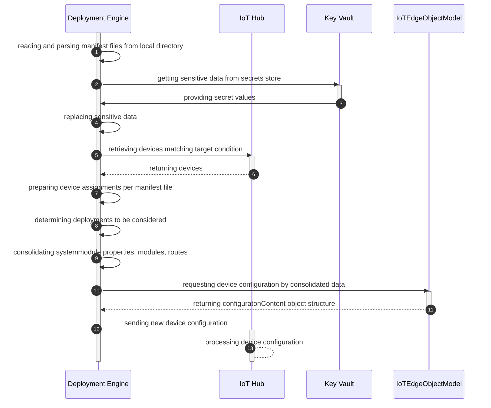
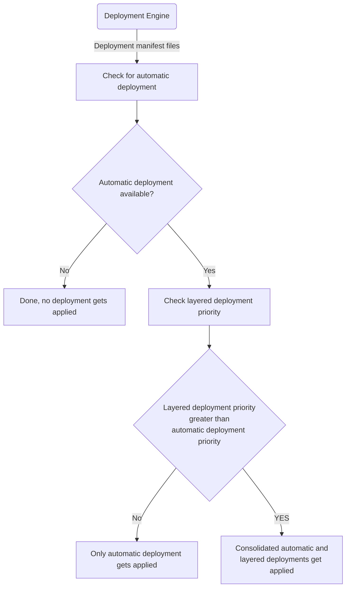

[](https://github.com/Bindsi/IoTEdgeDeploymentService/actions/workflows/CD_Infra.yml)

# Contents

- [Introduction](#introduction-at-scale-deployment)
- [Solution](#solution)
- [How-to](#how-to)

# Introduction: At-scale Deployment

Azure IoT Edge provides two ways of [deployments](https://learn.microsoft.com/en-us/azure/iot-edge/module-deployment-monitoring?view=iotedge-1.4).
On the hand you can create a deployment manifest to deploy modules and apply it to one single device.
On the other hand you can create a deployment manifest with a tag based filter and modules get applied to the registered devices that matches the defined condition.
The latter one contains automatic deployments where the deployments of the higher priority are only applied to the devices with the same tag(s)
and layered deployment where modules and routes are consolidated between different deployment definitions for the same devices based by higher priority.

Industries make use of at-scale deployments to define new sets of modules for devices categorized by different keys, e.g. country, region, plant, build etc.
Due to cost savings and to avoid a blown-up cloud environment the same IoT Hub instances are used over several departments.
Hence, the customers have the requirement to define a huge amount of at-scale deployments, particularly if they want to be downwards compatible.
Currently, there is still a limit of 100 at-scale deployments you can specify for the IoT Hub instance in Azure Portal or via IoT Hub SDK.
So, this leads to the need to build an own deployment engine without limitation with a kind of more flexibility.

# Solution

## File-based IoTEdgeDeploymentEngine

### Sequence Diagram for Deployment Processing



### Automatic and Layered Deployment Rules

IoT Hub applies automatic and layered deployments in a consolidated fashion based on predefined rules based on priority per devices met by the target condition.

A layered deployment requires an automatic deployment - including system modules like EdgeAgent and EdgeHub - as base deployment to get applied.
That means that every layered deployment with a lower priority than the automatic deployment with the highest priority is not applied to the subset of devices while only the automatic deployment with highest priority is deployed as well.

The following flow charts outlines those rules.



## Azure Functions IoTEdgeDeploymentApi

### Overview

Provides API and scheduler functionalities to manage the engine.
Swagger UI is fully supported and can be opened via the following [URL][def].

### Security

Azure Functions API is secured by OAuth2 and applied via ARM deployment in GitHub Actions workflow automatically.
Beforehand, you have to create two app registrations, one for that is referenced by the Azure Function for authentication and one that is used for the Implicit Flow in the Swagger UI provided by the Azure Functions.
The appId of the first app registrations needs to be configured as parameter for the ARM template and added to the GitHub secrets (see section below). Note that in parallel a Service Principal (Enterprise Application) is created that manages user specific group memberships and additional settings for login experience etc.

### LayeredDeployment

Provides the following endpoints:

- submit a new layered deployment manifest to be stored
- retrieve deployment manifest file content by a specified file path

### AutomaticDeployment

Provides the following endpoints:

- submit a new automatic deployment manifest to be stored
- retrieve deployment manifest file content by a specified file path

### DeploymentScheduler

Executes an automatic base and any additional layer into a single per device deployment on a timer-based way (default setup: 12:00am)

## Console App IoTEdgeDeploymentTester

A simple console application that can test the engine.

# How-to

## Pre-requisites for local testing

- .NET 6
- Visual Studio Code or Visual Studio 2022
- Azure CLI
- PowerShell 7.0.6 LTS or PowerShell 7.1.3 or higher (on Windows only: Windows PowerShell 5.1 is sufficient)
- [Az PowerShell][def6]

## Setup App Registrations via PowerShell

The following steps need to be executed manually due to limited permissions we will be assigning to a Service Principal to run other parts via GitHub Actions.

1. Execute `Connect-AzAccount -subscriptionId <yourSubscriptionId> -tenantId <yourTenantId>` to login to your Azure subscription in your PowerShell session

2. Execute the [PowerShell script][def3] by specifying the parameters tenantName (e.g. myTenantName.onmicrosoft.com) and app registration name (e.g. `yourprefixIoTEdgeDeploymentEngine`)

  ```powershell
  ./deployment/createServicePrincipal.ps1 -tenantName <yourtenant> -spName <yourprefixIoTEdgeDeploymentEngine>
  ```

3. Execute it again by specifying a different name for the Swagger UI and also for the Postman client (e.g. IoTEdgeDeploymentEnginePostman)

  ```powershell
  ./deployment/createServicePrincipal.ps1 -tenantName <yourtenant> -spName <yourprefixIoTEdgeDeploymentEnginePostman>
  ```

4. Login to your subscription in the Azure Portal and navigate to the "App Registration" section in Active Directory and do the following modifications for **both app registrations**:

- open the app registration and go to "Expose an API"
- add a scope and name it "user_impersonation", also add a displayname and description and save

- create a client secret in the "Certificates & secrets" blade. The secret is displayed after clicking the Add button, make sure you copy it and store it securely in your credential store or Key Vault instance as it will not be displayed to you again
- go the "Overview" page and click on the Service Principal link at "Managed application in local directory"
- navigate to the "Users and groups" section and add users of your choice


## Deployment of resources in Azure

You have three options for provisioning Azure resources and deploying the function code: automated through GitHub Actions, via PowerShell script, or by using a developer machine with AZ CLI and Visual Studio Code.

### Option 1: Through GitHub Actions

1. Use the GitHub Actions [workflow file][def2] and set it up in your fork
2. Create a new resource group

  ```CLI
  az group create -n <name> --location <location>
  ```

3. Add the following [secrets](https://docs.github.com/en/actions/security-guides/encrypted-secrets#creating-encrypted-secrets-for-a-repository) in your repository settings:

- `AZURE_CREDENTIALS` --> store the json by following the [instructions](https://learn.microsoft.com/en-us/azure/azure-resource-manager/templates/deploy-github-actions?tabs=userlevel#generate-deployment-credentials) to obtain your subscription credentials. Provide the resource group name created in step 2 above.
- `AZURE_SUBSCRIPTION` --> Azure Subscription id
- `AZURE_RG` --> Azure Resource Group name you created in step 2
- `RESOURCE_NAME` --> name of all Azure resource deployed by the ARM template, prefixes are added inline by using [official recommendations](https://learn.microsoft.com/en-us/azure/cloud-adoption-framework/ready/azure-best-practices/resource-abbreviations)
- `TENANT_ID` --> Id of the AAD Tenant
- `APP_ID` --> Id (ClientId) of the first App Registration in step above among **Securitiy** section
4. Commit to the main branch for triggering the GitHub Action.

###  Option 2: Through PowerShell

The following steps can be used to deploy the ARM template instead of using the GitHub Actions workflow (described in a section below). It deploys all Azure artifacts without Azure Functions code which is not required as executed locally.

1. Execute `Connect-AzAccount -subscriptionId <yourSubscriptionId> -tenantId <yourTenantId>` to login to your Azure subscription in your PowerShell session.

2. Navigate to `./deployment` directory.

3. Execute the [PowerShell script][def7] by specifying the parameters

- `resourceGroupName` - target Azure Resource Group (will be created if it doesn´t exist)
- `location` - location for your Resource Group (default: West Europe)
- `resourceName` - base name for all your resource (prefix added by ARM template inline)
- `tenantId` - Id of the Azure tenant used for your Active Directory resources
- `appId` - App Registration Id of the first app registration from the step above in previous section (e.g. `yourprefixIoTEdgeDeploymentEngine`)

  ```powershell
  ./deployment/deployArmTemplate.ps1 -resourceGroupName <yourRG> -location <yourLocation> -resourceName <yourResourceName> -tenantId <yourAADtenantId> -appId <yourprefixIoTEdgeDeploymentEngineId>
  ```

4. Publish the Azure Function found under `./src/IoTEdgeDeploymentApi` through Visual Studio Code or Visual Studio IDE, per your preference.

###  Option 3: from local environment with Azure CLI and Visual Studio Code

1. In your terminal, move into the folder `./deployment`
2. Create a new resource group

  ```CLI
  az group create -n <name> --location <location>
  ```

3. Create a file `azuredeploy.parameters.temp.json` based on the `azuredeploy.parameters.json` file in that directory. Provide the values:
  - `resourceName` - base name for all your resource (prefix added by ARM template inline).
  - `tenantId` - Id of the Azure tenant used for your Active Directory resources.
  - `appId` - App Registration Id of the first app registration from the step above in previous section (e.g. `yourprefixIoTEdgeDeploymentEngine`).
4. Run the deployment:

  ```bash
  az deployment group create --name azuredeploy --resource-group <resource_group_created_above> --template-file azuredeploy.json --parameters azuredeploy.parameters.temp.json
  ```

5. Publish the Azure Function found under `./src/IoTEdgeDeploymentApi` through Visual Studio Code or Visual Studio IDE, per your preference.
6. Add your User Managed Identity to IoT Hub roles `IoT Hub Registry Contributor`, `IoT Hub Twin Contributor` and `IoT Hub Data Contributor` so the function running locally has permissions to call into the Azure IoT Hub API and also the `Key Vault Secrets User` and `Key Vault Secrets Officer` roles to call the Key Vault instance (last one only required to manually add secrets via Azure Portal, not for running the Azure Functions itself).

## Local developer testing

**Prerequisites**

Have gone through the setup of the Azure resources through one of the options above.

### IoTEdgeDeploymentTester console app testing

**Steps**
- Add your own user to the RBAC roles `IoT Hub Registry Contributor`, `IoT Hub Twin Contributor` and `IoT Hub Data Contributor` to the IoT Hub created above. This will give your developer account permissions to run the Function and Tester application with Visual Studio (Code) using your Azure credentials.
- In the Azure Key Vault, assign your own user to the RBAC roles `Key Vault Secrets User` and `Key Vault Secrets Officer`. This will give your developer account permissions to run the Function and Tester application with Visual Studio (Code) using the Azure credentials. The latter one is not required to run the program but it allows you to add secrets to the Key Vault which are used to replaced the placeholders in the manifest file with sensitive data.
- Create at least one IoT Edge device with a tag of `env` set to `device100` or `device200` for the supplied manifests to match. You can do this with the below command:

```bash
# create device with a tag of env=device100
az iot hub device-identity create -n <iot-yourprefix> -d device100 --ee
az iot hub device-twin update -n <iot-yourprefix> -d device100 --tags '{"env": "device100"}'

# if using PowerShell, escape double quotes: 
# az iot hub device-twin update -n iot-kdg0123 -d mydevice --tags '{\"env\": \"device100\"}'

# create a device with tag of iiot=true
az iot hub device-identity create -n <iot-yourprefix> -d mydevice --ee
az iot hub device-twin update -n <iot-yourprefix> -d mydevice --tags '{"iiot": "true"}'

```
- Create three secrets in the Azure Key Vault for replacing placeholders with a secret upon deployment (using the sample manifests), the values can be anything for testing:

```bash
az keyvault secret set --name address --vault-name <kv-yourprefix> --value <myacr.azureacr.io>

az keyvault secret set --name password --vault-name <kv-yourprefix> --value <mypwd>

az keyvault secret set --name username --vault-name <kv-yourprefix> --value <myusername>
```

**Run the console app:**

1. Create a `.env` file based on the `.env.template` file in the project folder.
2. Supply the following values:

  - `IOTHUB_HOSTNAME` = IoT Hub hostname in the form of `xxx.azure-devices.net`.
  - `KEYVAULT_URI` = Key Vault URI including `https://` prefix.
  - `ROOT_MANIFESTS_FOLDER` = absolute path to the `./manifests` folder in this repo.

3. Include additional DI registration and methods calls of your choice into the Program.cs and run the program.
4. This test program will apply the manifests matching your devices.

### Azure Functions local testing in Visual Studio (Code or full IDE)

1. Create a `local.settings.json` file in the Functions project root `src/IoTEdgeDeploymentApi`. You can copy the initial content from `local.settings.json.template` provided in the repo and update the values.

- `IOTHUB_HOSTNAME` = IoT Hub host name
- `KEYVAULT_URI` = Key Vault URI
- `ROOT_MANIFESTS_FOLDER` = Local absolute path to the `./manifests` folder in this repo.
- `OpenApi__Auth__TenantId` = your AAD tenant ID
- `OpenApi__Auth__Scope` = the name of the scope you created in Azure AD for the first app registration. Looks something like `https://xxxxxxxx-xxxx-xxxx-xxxx-xxxxxxxxxxxx.fdpo.onmicrosoft.com/user_impersonation`

4. Run the function with Azure Functions tools v4.
5. Test the function by opening the [Swagger UI][def].

#### Swagger UI

Swagger UI setup is configured to use Implicit Flow and Bearer Authentication (by simply providing a JWT).
If you open Swagger UI locally you don´t need to authenticate with a Bearer token against the endpoint.
On the cloud app service you have two options:

- add the `appId` of the second app registration you created in the step before (you can find it on the overview site) and select the scope created previously
- create a Bearer token by using the [Postman collection][def5] changing the following properties:

  - Azure Tenant ID in URL
  - client_id (appId) and client_secret of the second app registration created before
  - resource --> appId of the first app registration created above


If you want to add different authentication flows, please read the [open api auth docs](https://github.com/Azure/azure-functions-openapi-extension/blob/8cb58af111928088b4f6c07fdf482f6ee5bdf59d/docs/openapi-auth.md) and refer to the [authentication sample repo for Swagger](https://github.com/devkimchi/azure-functions-oauth-authentications-via-swagger-ui).

## Testing the Azure Function in the cloud

Go to the deployed Azure Function App and copy the URL.
In your browser go to `https://<yourfunctionname>.azurewebsites.net/api/swagger/ui/`. You will be redirected to AD authentication. Consent and from there you can use the Swagger to test out the API.

## Cleaning up resources

- Delete the Azure Resource group.
- Delete the App registrations in Azure Active Directory.

[def]: http://localhost:7071/api/swagger/ui
[def2]: /.github/workflows/CD_Infra.yml
[def3]: /deployment/createServicePrincipal.ps1
[def5]: /postman/IoTEdgeDeploymentService.postman_collection.json
[def6]: https://learn.microsoft.com/en-us/powershell/azure/install-az-ps?view=azps-8.3.0
[def7]: /deployment/deployArmTemplate.ps1
