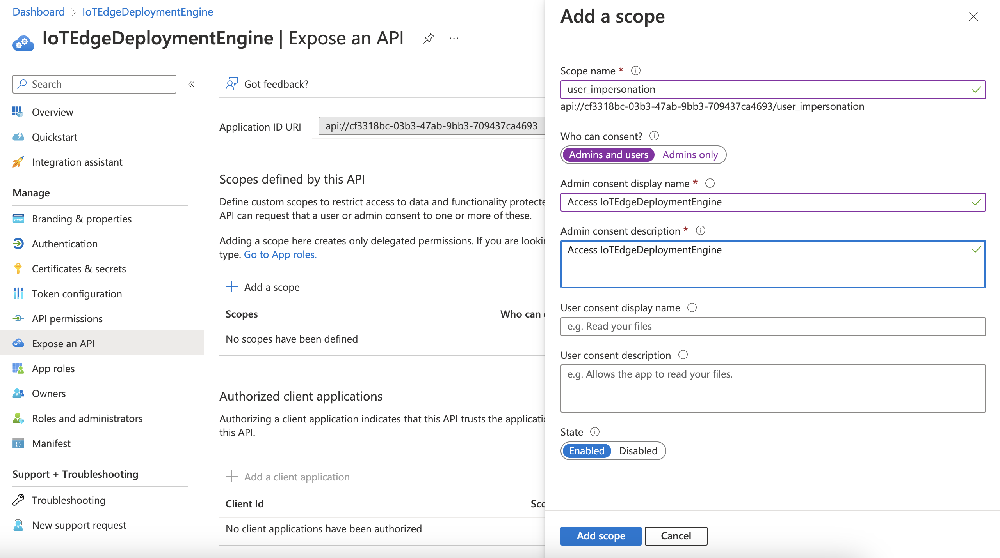

# At-scale Deployment

Azure IoT Edge provides two ways of [deployments](https://learn.microsoft.com/en-us/azure/iot-edge/module-deployment-monitoring?view=iotedge-1.4). 
On the hand you can create a deployment manifest to deploy modules and apply it to one single device.
On the other hand you can create a deployment manifest with a tag based filter and modules get applied to the registered devices that matches the defined condition.
The latter one contains automatic deployments where the deployments of the higher priority are only applied to the devices with the same tag(s) 
and layered deployment where modules and routes are consolidated between different deployment definitions for the same devices based by higher priority.

Industries make use of at-scale deployments to define new sets of modules for devices categorized by different keys, e.g. country, region, plant, build etc.
Due to cost savings and to avoid a blown-up cloud environment the same IoTHub instances are used over several departments.
Hence, the customers have the requirement to define a huge amount of at-scale deployments, particularly if they want to be downwards compatible.
Currently, there is still a limit of 100 at-scale deployments you can specify for the IoTHub instance in Azure Portal or via IoTHub Sdk.
So, this leads to the need to build an own deployment engine without limitation with a kind of more flexibility.

# Solution

## File-based IoTEdgeDeploymentEngine

### Layered Deployment

Consolidates deployment manifests per device tag and target condition and creates a merged version including the determined modules and routes to be applied on the devices.
Deployment manifest are stored on the file system in the default schema.

### Automatic Deployment

Applies the latest relevant deployment manifest per device tag based on the highest priority setting to the devices.
As well as for layered deployments the configurations are stored on the file system

## Azure Functions IoTEdgeDeploymentApi

### Overview

Provides API and scheduler functionalities to manage the engine.
Swagger UI is fully supported and can be opened via the following [URL][def].

### Security

Azure Functions API is secured by OAuth2 and applied via ARM deployment in GitHub Actions workflow automatically.
Beforehand, you have to create two app registrations, one for that is referenced by the Azure Function for authentication and one that is used for the Implicit Flow in the Swagger UI provided by the Azure Functions.
The appId of the first app regestrations needs to be configured as parameter for the ARM template and added to the GitHub secrets (see section below). Note that in parallel a Service Principal (Enterprise Application) is created that manages user specific group memberships and additional settings for login experience etc.

### LayeredDeployment

Provides the following endpoints:

- submit a new layered deployment manifest to be stored
- retrieve deployment manifest file content by a specified file path

### AutomaticDeployment

Provides the following endpoints:

- submit a new automatic deployment manifest to be stored
- retrieve deployment manifest file content by a specified file path

### LayeredDeploymentScheduler

Executes layered deployment on a timer-based way (default setup: 12:00am)

### AutomaticDeploymentScheduler

Executes layered deployment on a timer-based way (default setup: 12:00am)

### How-to

#### Setup App Registrations via PowerShell

1. Execute Connect-AzAccount -subscriptionId <yourSubscriptionId> -tenantId <yourTenantId> to login to your Azure subscription in your PowerShell session
1. Execute the [PowerShell script][def3] by specifying the parameters tenantName (e.g. myTenantName.onmicrosoft.com) and app registration name (e.g. IoTEdgeDeploymentEngine)
2. Execute it again by specifying a different name for the Swagger UI and also for the Postman client (e.g. IoTEdgeDeploymentEnginePostman)
3. Login to your subscription in the Azure Portal and navigate to the "App Registration" section in Active Directory and do the following modifications for both app registrations:

- open the app registration and go to "Expose an API"
- add a scope and name it "user_impersonation", also add a displayname and description and save it then

- create a secret the "Certificates & secrets" blade and save it securely in your credential store or Key Vault instance
- go the "Overview" page and click on the Service Principal link at "Managed application in local directory"
- navigate to the "Users and groups" section and add users of your choice

#### Settings

Just paste the IoTHub connection string, your Azure tenant id and the scope of the first app registration you created in the previous section into the local.settings.json.
Make sure that your access policy for the IoTHub includes "Registry Read|Write" permissions (you can use iothubowner).

#### Swagger UI

Swagger UI setup is configured to use Implicit Flow and Bearer Authentication (by simply providing a JWT).
If you open Swagger UI locally you don´t need to authenticate with a Bearer token against the endpoint.
On the cloud app service you have two options:

- add the appId of the second app registration you created in the step before (you can find it on the overview site) and select the scope created previously
- create a Bearer token by using the [Postman collection][def5] changing the following properties:

  - Azure tenant id in url
  - client_id (appId) and client_secret of the second app registration created before
  - resource --> appId of the first app registration created above

If you want to add different authentication flows, please read the [open api auth docs](https://github.com/Azure/azure-functions-openapi-extension/blob/8cb58af111928088b4f6c07fdf482f6ee5bdf59d/docs/openapi-auth.md) refer to the [authentication sample repo for Swagger](https://github.com/devkimchi/azure-functions-oauth-authentications-via-swagger-ui).

## Console application IoTEdgeDeploymentTester

### Overview

A simple app that can test the engine.

### How-to

1. Just paste the IoTHub connection string into the console application properties/run configuration as first argument.
Make sure that your access policy includes "Registry Read|Write" permissions (you can use iothubowner).
2. Include additional DI registration and methods calls of your choice into the Program.cs.

## Deployment

1. use the GitHub Actions [workflow file][def2] and set it up in your fork
2. just add the following [secrets][def4] in your repository settings:

- AZURE_CREDENTIALS --> store the json by following the [instructions](https://learn.microsoft.com/en-us/azure/azure-resource-manager/templates/deploy-github-actions?tabs=userlevel#generate-deployment-credentials) to obtain your subscription credentials
- AZURE_SUBSCRIPTION --> Azure Subscription id
- AZURE_RG --> Azure Resource Group name
- IOTHUB_CONSTRING --> Azure IoTHub connection string
- STORAGEACCOUNT_NAME --> Azure Storage Account name
- APPINSIGHTS_NAME --> Azure Application Insights name
- HOSTINGPLAN_NAME --> Azure App Service Plan name
- AZUREFUNC_NAME --> Azure Functions name
- TENANT_ID --> Id of the AAD Tenant
- APP_ID --> Id (ClientId) of the App Registration reflecting Azure Functions (App Service) and created in step above among **Securitiy** section

[def]: http://localhost:7071/api/swagger/ui
[def2]: /.github/workflows/CD_Infra.yml
[def3]: /deployment/createServicePrincipal.ps1
[def4]: https://docs.github.com/en/actions/security-guides/encrypted-secrets#creating-encrypted-secrets-for-a-repository
[def5]: /postman/IoTEdgeDeploymentService.postman_collection.json